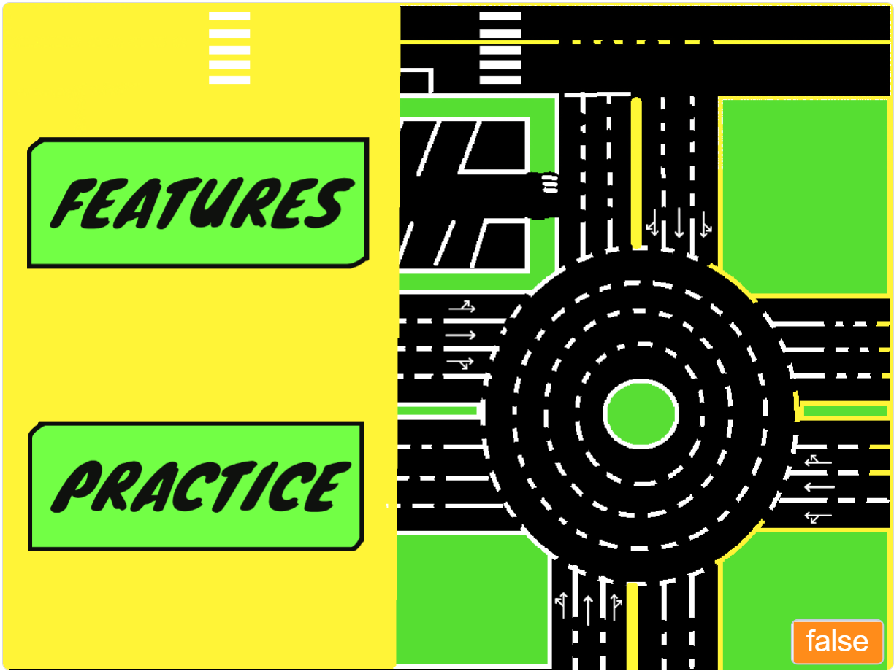

<h1 align="center">
   
  
   
 	<a href="https://caaradar.co.ke"> Caaradar </a> 
   
</h1>

>**CAARADAR** is derived from Swahili words *kaa rada* meaning **stay woke** 

## Keeping Kenyan roads safe
BBC africa released a documentary on youtube exposing dodgy driving licences and dangerous vehicles on Kenya’s killer roads.
[Kenya’s Killer Roads - BBC Africa Eye documentary](https://www.youtube.com/watch?v=papUXpLXf8I)

Between 2020 and 2021 Kenyan road deaths rose more than 20 per cent. Last year, more than 4,500 were killed and over 16,000 injured.
The documentary exposed rogue driving school employees who, for a fee, fix it for rookie drivers to get behind the wheel without ever having to take a driving test.

This SCRATCH project is meant to digitize the driving training theory process and even the practicals via simulators.

